Si tienes dudas de como usar la aplicación:

Menu:

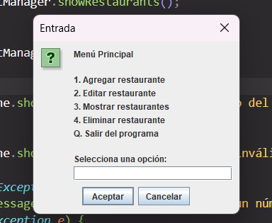

Agregar Restaurante:

Nombre:

Localización:

Horario:

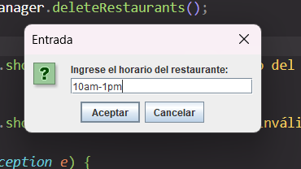

Puntuación:

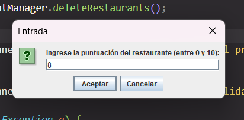

Editar Restaurante:

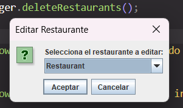

Nuevo nombre:

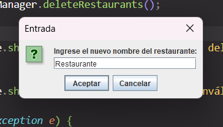

Nueva localización:

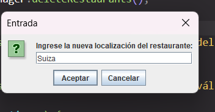

Nuevo horario:

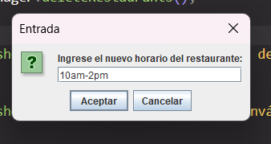

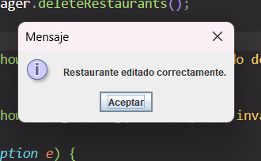

Mostrar Restaurantes:
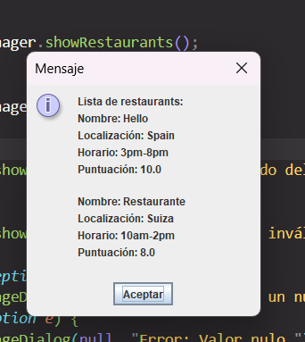

Eliminar Restaurante:

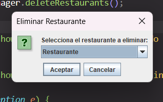

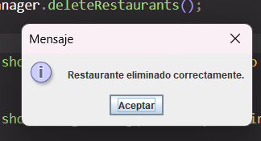
